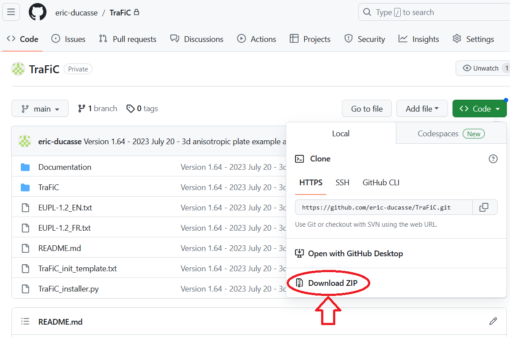

# <tt>TraFiC</tt> installation
1. Download <tt><b>TraFiC</b></tt> and unzip it:
      
1. In <b>Anaconda Prompt</b> (Windows) or a <b>terminal</b> (Linux, Mac):   
   > <tt><b>(base)...> conda activate trafic_env</b></tt> </b></tt>   
   > <tt><b>(trafic_env)...> cd <i><TraFiC_root_path></i> </b></tt>  
   > <tt><b>(trafic_env)...> python TraFiC_installer.py </b></tt>   
1. To Launch the GUI (Incomplete software under development):   
   > <tt><b>(trafic_env)...> cd TraFiC</b></tt>  
   > <tt><b>(trafic_env)...> python TraFiC_GUI_Launcher.py </b></tt>    
2. Basic examples without GUI are in the directory <tt><b>Examples_without_GUI</b></tt>.   
